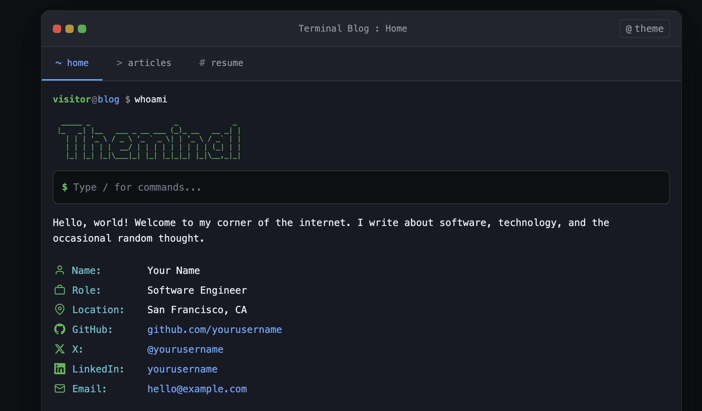

# Theminal

A terminal-inspired Hugo theme for developer blogs.



> This is the first minimal version - more features coming soon!

## Quick Start

1. Fork this repository
2. Edit `hugo.toml` with your info
3. Replace `content/articles/` with your posts
4. Enable GitHub Pages (Settings → Pages → Source: "GitHub Actions")
5. Push to `main` - your site deploys automatically

## Local Development

Requires [Hugo](https://gohugo.io/) v0.146.0 or later.

```bash
hugo server
```

Visit http://localhost:1313

## Configuration

Edit `hugo.toml`:

```toml
[params]
  author = "Your Name"
  role = "Software Engineer"
  email = "hello@example.com"
  welcome = "Your welcome message here"

  [params.social]
    github = "yourusername"
    x = "yourusername"
    linkedin = "yourusername"
```

## Creating Articles

```bash
hugo new articles/my-post.md
```

## Features

- Dark/light theme toggle (press `t` or click button)
- Mini terminal with `/commands`
- Syntax highlighting for code blocks
- Resume page
- RSS feed
- Mobile responsive

## Keyboard Shortcuts

| Key | Action |
|-----|--------|
| `/` | Focus terminal |
| `t` | Toggle theme |

## License

MIT
